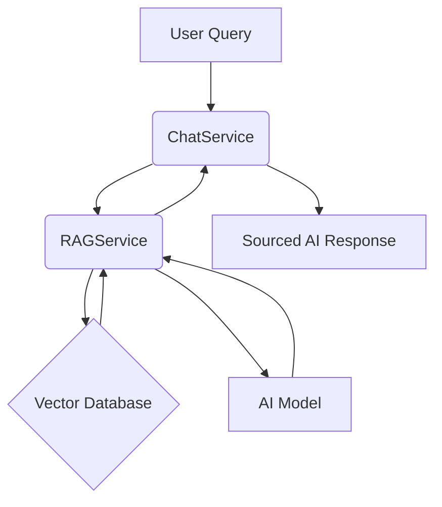

# RAGService Design (Refactored)

## Overview

The `RAGService` will be refactored from the existing `ChatService` to encapsulate the core Retrieval-Augmented Generation (RAG) logic. This service will be responsible for handling user queries by searching for relevant document chunks, labeling them with their source, and combining them into a single response string for the AI model.

## Requirements

1.  **Search**: Search for relevant document chunks using embeddings.
2.  **Labeling**: Label each chunk with its document source.
3.  **General Knowledge**: Label general knowledge answers.
4.  **Combining**: Combine all chunks into a single response string.
5.  **Truncation**: Truncate context safely at sentence boundaries.
6.  **Source Citation**: Explicitly show sources for all content.

## Architecture



## Interface (IRAGService.cs)

```csharp
namespace EduShelf.Api.Services
{
    public interface IRAGService
    {
        Task<string> GetAiResponseAsync(string query, int userId);
    }
}
```

## Class (RAGService.cs)

```csharp
namespace EduShelf.Api.Services
{
    public class RAGService : IRAGService
    {
        public Task<string> GetAiResponseAsync(string query, int userId)
        {
            // Logic extracted from ChatService
            // 1. Search for relevant document chunks in the vector database.
            // 2. Label each chunk with its source document.
            // 3. Combine chunks into a single context string.
            // 4. Truncate context if it exceeds the model's limit.
            // 5. Send the context and query to the AI model.
            // 6. Label any general knowledge in the AI's response.
            // 7. Return the sourced AI response.
            throw new NotImplementedException();
        }
    }
}
```

## ChatService (Updated)

```csharp
namespace EduShelf.Api.Services
{
    public class ChatService
    {
        private readonly IRAGService _ragService;

        public ChatService(IRAGService ragService)
        {
            _ragService = ragService;
        }

        public Task<string> GetResponseAsync(string userInput, int userId)
        {
            return _ragService.GetAiResponseAsync(userInput, userId);
        }
    }
}
```

## Service Registration (Program.cs)

```csharp
builder.Services.AddScoped<IRAGService, RAGService>();
builder.Services.AddScoped<ChatService>();